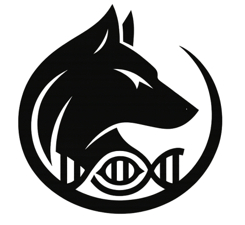

# Padfoot
<p>

<b>Padfoot</b> is a structural variant (SV) and copy number alteration (CNA) annotation tool designed to work seamlessly with output from <b>Severus</b> and <b>Wakhan</b>. It provides biological and functional annotations for SVs and CNAs, enabling downstream interpretation of genomic alterations.
</p>

<br/>


## Features

- Annotates somatic SVs called by [Severus](https://github.com/KolmogorovLab/Severus)
- Annotates CNAs reported by [Wakhan](https://github.com/KolmogorovLab/Wakhan)
- Outputs functional annotations for prioritization
- Designed for cancer genome analysis using long-read data


## Contents

* [Installation](#installation)
* [Quick Usage](#quick-usage)
* [Input and Parameters](#inputs-and-parameters)


## Installation

The easiest way to install is through conda:

```
conda create -n padfoot_env padfoot
conda activate padfoot_env
severus --help
```

Or alternatively, you can clone the repository and run without installation,
but you'll still need to install the dependencies via conda:

```
git clone https://github.com/KolmogorovLab/Padfoot.git
cd Padfoot
conda env create --name padfoot_env --file environment.yml
conda activate padfoot_env
./padfoot.py
```

## Quick Usage

```
padfoot --severus-vcf severus_somatic.vcf --wakhan-vcf wakhan_cna.vcf --ref ref.fa --out-dir padfoot_out -t 16 --specie human 
```

## Inputs and Parameters

### Required

```
--severus-vcf   path to Severus vcf
--wakhan-vcf    path to Wakhan vcf
--ref           path to reference fasta file (needs to be indexed)
--out-dir       path to output directory
```

### Optional parameters

```
--threads               number of threads [8]
--specie                human or mouse or user defined(GFF and rm files need to be provided) [human]
--genome                Either hg38, chm13 or mm10 [hg38]
--gff                   If user want to use a alternative gff
--rm                    Repeat masker file (.fa.out)
```

### Genome Annotations

We provide default **GFF** and **RepeatMasker** annotation files in the `bed/` directory.

If you would like to use a different genome assembly or custom annotations, you can specify your own files using the following parameters:

- `--gff`: Path to a custom GFF annotation file  
- `--rm`: Path to a custom RepeatMasker BED file  
- `--specie`: Specify the species or genome build (e.g., `hg38`, `chm13`)

These options allow flexibility for applying **Padfoot** to a variety of genome references and annotation sources.

### 📁 Output

The output is a tab-delimited file containing:

- Annotated SVs and CNAs
- Gene overlaps and exon-level effects  
- Functional impact scores  
- Complex SV plots


License
-------

Padfoot is distributed under a BSD license. See the [LICENSE file](LICENSE) for details.


Credits
-------

Padfoot was developed by the Kolmogorov Lab at the National Cancer Institute as part of ongoing efforts to improve interpretation of long-read somatic variant data in cancer genomics.

Key contributors:

* Ayse Keskus
* Mikhail Kolmogorov

---
### Contact
For advising, bug reporting and requiring help, please submit an [issue](https://github.com/KolmogorovLab/Padfoot/issues).
You can also contact the developer: aysegokce.keskus@nih.gov
